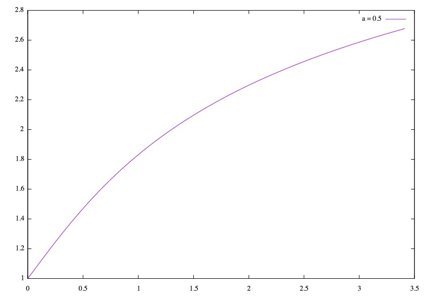
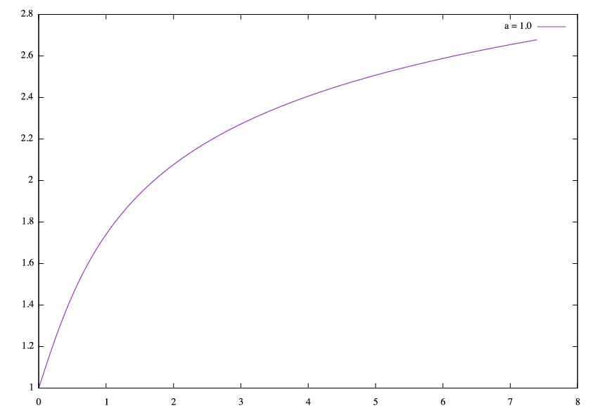

# 演習課題6
## 一階への変形
まずは以下の二階微分方程式

$$
y'' - a(1 - y^2)y' + y = 0
$$
$$
y(0) = 1, y'(0) = 0
$$
を変数変換$ z = y' $で一階微分方程式の連立方程式にすると
$$
z' - a(1 - y^2)z + y = 0
$$
$$
y' = z
$$
となる。ただし$ z'(0) = 1, y'(0) = 0 $である。

これを元に以下で計算する.
## 計算
```
#include<stdio.h>
#include<math.h>

double f(z,a,y)
     double z;
     double a;
     double y;
 {  double dz;
   dz = -a*(1-y*y)*z + y;
  return (dz);
  }

double g(z)
  double z;
{ double y;
  y = z;
  return y;
}

int main(){
  int N = 100;
  int i, j;
  double a;
  double z[N];
  double y[N];
  double h = 1.0/N;

  //初期値の設定
  z[0] = 0.0;
  y[0] = 1.0;

  a = 1.0;

  for(i = 1; i < N; i++){
   z[i] = z[i-1] + h* f(z[i-1],a,y[i-1]); 
   y[i] = y[i-1] + h*g(y[i-1]);
   printf("z[%d] = %lf  y[%d] = %lf\n", i, z[i], i, y[i]);
  }
```

## 計算結果とグラフへのプロット
上のプログラムで計算しgnuplotを使い表示した。

### $ a = 0.5  $

### $ a = 1.0  $


